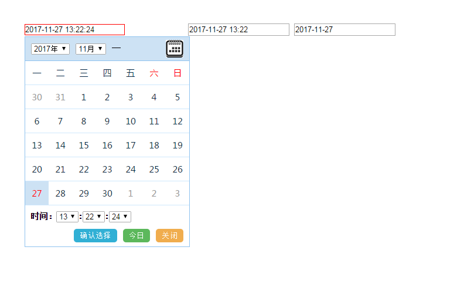

# Calendar

效果如下

//----------2017-12-5更新
针对YYYY-MM-DD hh:mm:ss
增加开始时间  startTime
结束时间 endTime

只设置startTime，选中时间应小于等于startTime
只设置endTime，选中时间应大于等于endTime

同时设置startTime与endTime ,选中时间应在两者之间

//----------2017-12-22更新
自定义开始和结束时间提示语
小于指定时间，startMessage：
大于指定时间：endMessage

